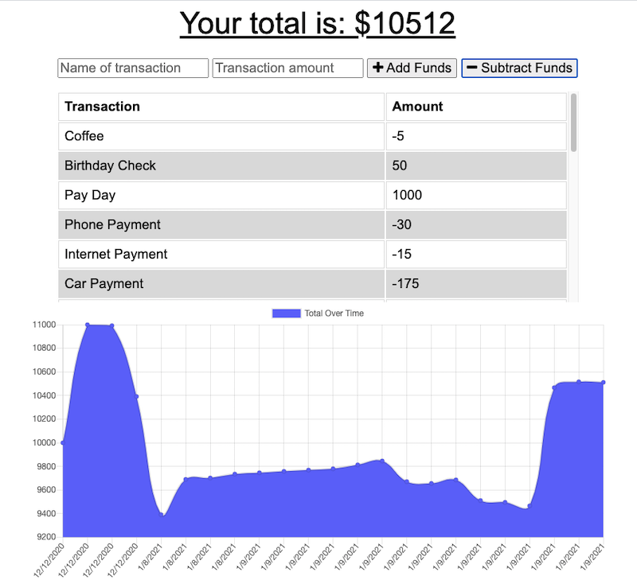

# Online_Offline_Budget_Tracker
This is a progressive web app (PWA) budget tracker. Users can add and subtract funds from their budget with or without an internet connection. Transactions entered offline will populate and recalculate the total when the app is brought back online.

---
 

[LIVE ON HEROKU](https://ancient-eyrie-10493.herokuapp.com/)

### Table of Contents
- [Screen Shots](#screen-shots)
- [User Story](#user-story)
- [Business Context](#business-context)
- [Technologies](#technologies)
- [License](#license)
- [Author Info](#author-info)

---
 

### Screen Shots

### User Story
AS AN avid traveller
I WANT to be able to track my withdrawals and deposits with or without a data/internet connection
SO THAT my account balance is accurate when I am traveling

---
 

### Business Context

Giving users a fast and easy way to track their money is important, but allowing them to access that information anytime is even more important. Having offline functionality is paramount to our applications success.

---
 

### Technologies
- HTML5
- CSS3
- JavaScript
- Node.js
- Express
- MongoDB
- Mongoose
- IndexedDB
- Service Worker

---
 

### License

None

---
 

### Author Info

Feel free to reach out with any questions or suggestions for improvement.
- Linkedin - [Katie Pindell](https://www.linkedin.com/in/katie-pindell-6ba25364/)

